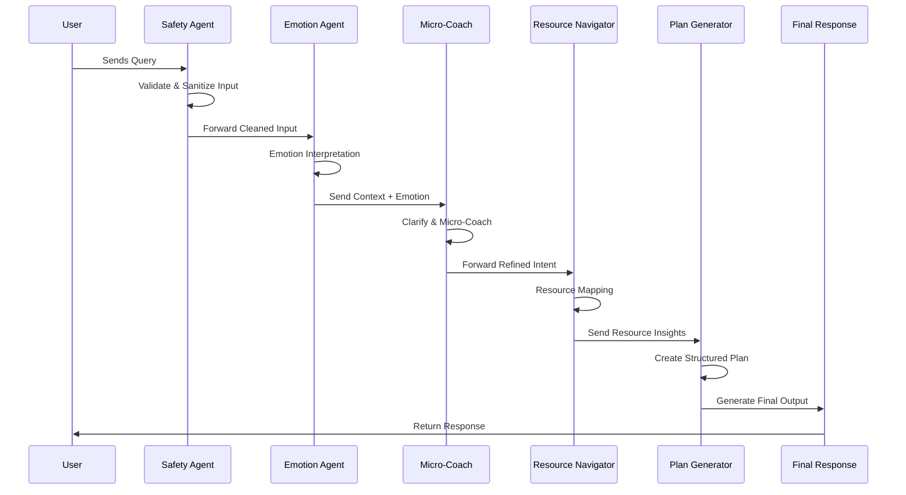

### 🧠 MindCompass — Multi-Agent Well-Being Resource Navigator & Micro-Coach
A safe, non-diagnostic, multi-agent well-being assistant designed to help users navigate emotional overwhelm, stress, low focus, or everyday struggles—while staying ethical, resource-oriented, and safety-compliant.

MindCompass is built using multi-agent orchestration, lightweight memory, and an optional Gradio/Streamlit chat UI.

---

## ⭐ Why MindCompass?
People dealing with stress or emotional overwhelm often struggle to find trustworthy well-being resources or actionable steps quickly.

MindCompass provides:

🧭 Emotion detection

💬 Safe micro-coaching actions

🌱 Personalized 7-day mini well-being plans

🔗 Trusted “resources-only” mental-health navigation

🛡️ Crisis detection & safety guardrails (no therapy, diagnosis, or medical advice)

----
### 🧩 Multi-Agent Architecture

MindCompass Multi-Agent Orchestration — System Description

MindCompass follows a structured, safety-first multi-agent workflow that processes user messages in a controlled, ethical, and highly modular pipeline. Each agent is responsible for a distinct cognitive task, enabling the system to remain predictable, explainable, safe, and non-diagnostic.

The overall interaction begins with a user query and flows through a series of lightweight agents:

### 🔹 MindCompass Multi-Agent Workflow (Short Summary)

- **Safety Agent**  
  Screens user messages for crisis or self-harm signals and redirects to emergency help if needed.

- **Emotion Agent**  
  Extracts emotional cues (stress, overwhelm, sadness, focus issues) without performing any diagnosis.

- **Micro-Coach Agent**  
  Provides safe, practical 1–2 minute micro-actions (breathing, grounding, reflection prompts).

- **Resource Navigator**  
  Maps user needs to trusted, pre-verified well-being resources.

- **Plan Generator**  
  Creates an optional personalized 7-day micro-well-being plan.

- **Orchestrator**  
  Coordinates all agents and produces the final, clean, supportive response.


The diagram below illustrates the complete, step-by-step orchestration that powers MindCompass.



-----
## 🏗️ Project Structure
```text
mindcompass/
│
├── README.md
├── writeup.md
├── requirements.txt
│
├── agents/
│   ├── emotion_agent.py
│   ├── microcoach_agent.py
│   ├── resource_agent.py
│   ├── safety_agent.py
│   ├── plan_agent.py
│
├── core/
│   ├── orchestrator.py
│   ├── memory.py
│
├── ui/
│   ├── gradio_app.py
│   ├── streamlit_app.py
│
└── notebooks/
    └── mindcompass_dev.ipynb


```
